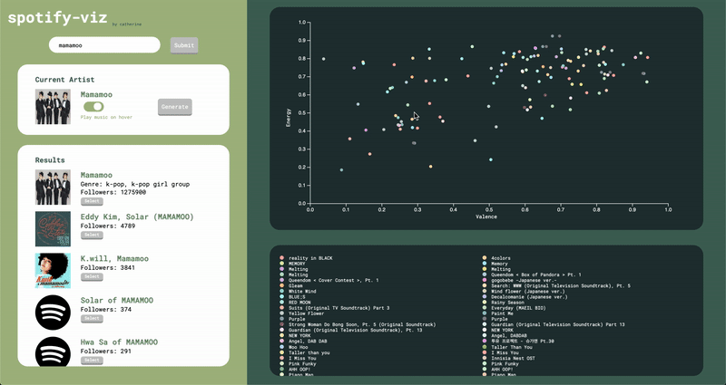

# spotify-viz 🎵

A web application where you can enter an artist and visualize the audio features (valence and energy) of the artist's songs

[https://spotifyviz.herokuapp.com/](https://spotifyviz.herokuapp.com/)

## Running locally

- Make sure you have node and npm installed
- `git clone` this repository
- `cd` into this directory on your computer
- Set `CLIENT_ID`, `CLIENT_SECRET`, and `FRONTEND_URI` in your environment variables
- Run `npm install` in this directory and in the `clients` directory
- Run `node index.js` in this directory to start the server and run `npm start` in the `client` directory to start the client

## About

### Technologies Used

- React.js
- D3.js
- Node.js
- Express.js
- Spotify API
